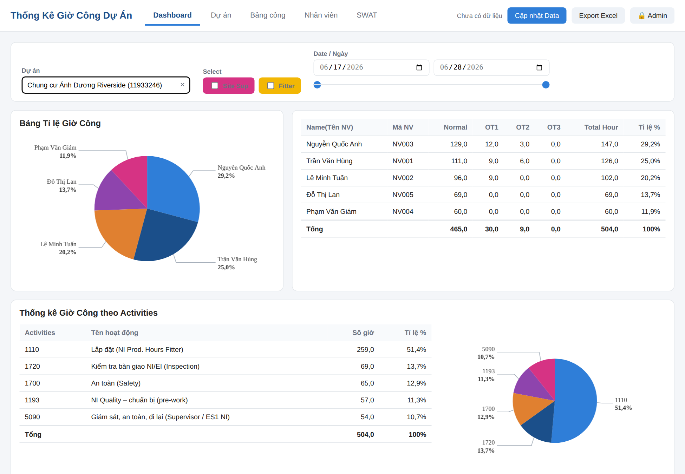
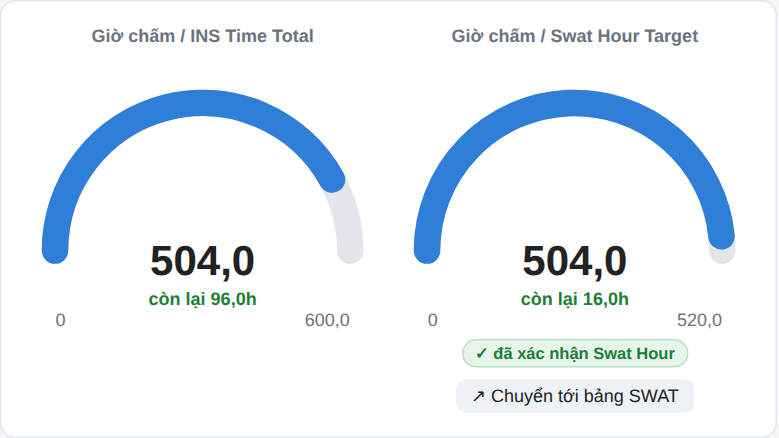
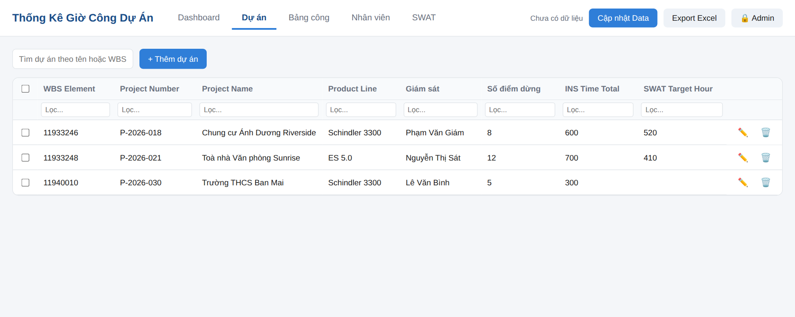
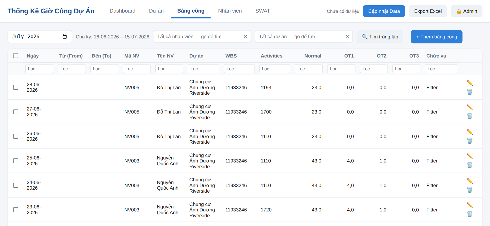
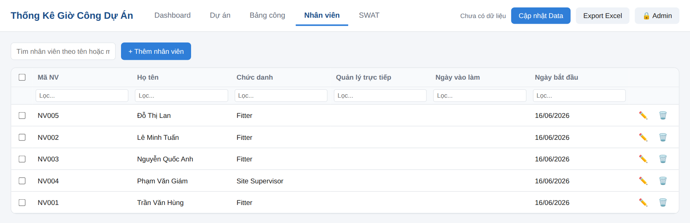
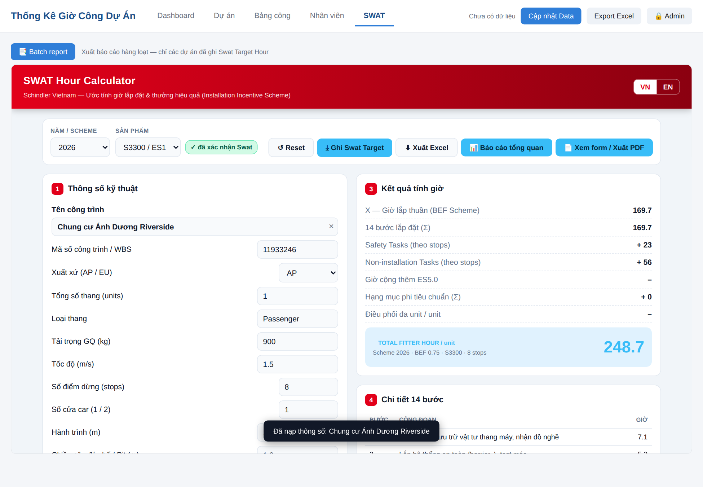
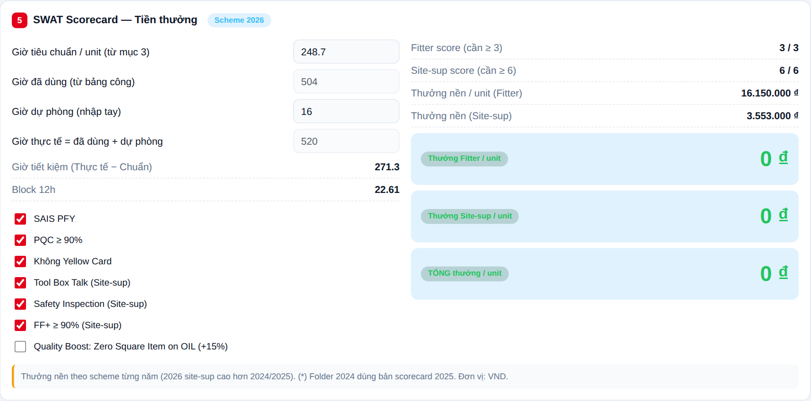
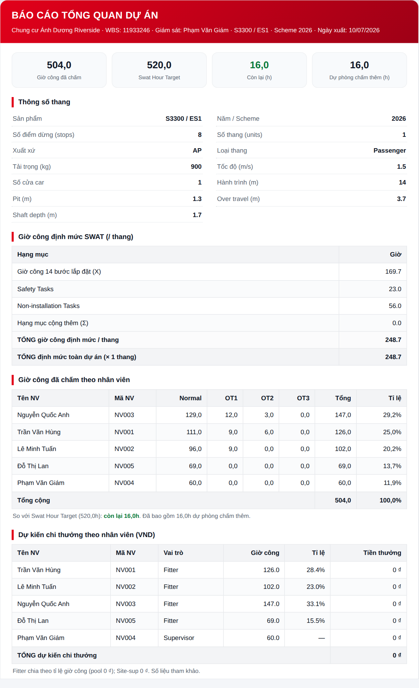
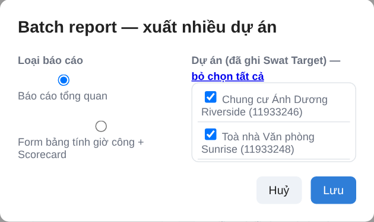

# Hướng dẫn sử dụng — Phần mềm Thống Kê Giờ Công Dự Án (TrackingTS)

> Phiên bản: **Phase 1**
> Đối tượng: quản lý dự án (PM/PE), giám sát công trình, bộ phận NI của Schindler Vietnam.

TrackingTS là ứng dụng web thống kê **giờ công lắp đặt thang máy** theo dự án, kèm công cụ **SWAT Hour Calculator** để ước tính giờ công định mức và tiền thưởng theo Installation Incentive Scheme.

Ứng dụng chạy trực tiếp trên trình duyệt (không cần cài đặt). Dữ liệu được lưu **trong trình duyệt của bạn** (IndexedDB) và có thể **đồng bộ qua Google Drive**.

---

## Mục lục

1. [Bắt đầu nhanh](#1-bắt-đầu-nhanh)
2. [Giao diện tổng quan](#2-giao-diện-tổng-quan)
3. [Chế độ Admin](#3-chế-độ-admin)
4. [Cập nhật / nhập dữ liệu](#4-cập-nhật--nhập-dữ-liệu)
5. [Sao lưu, khôi phục & Google Drive](#5-sao-lưu-khôi-phục--google-drive)
6. [Tab Dashboard](#6-tab-dashboard)
7. [Tab Dự án](#7-tab-dự-án)
8. [Tab Bảng công](#8-tab-bảng-công)
9. [Tab Nhân viên](#9-tab-nhân-viên)
10. [Tab SWAT (bộ tính giờ & tiền thưởng)](#10-tab-swat)
11. [Xuất báo cáo](#11-xuất-báo-cáo)
12. [Batch report — xuất nhiều dự án một lúc](#12-batch-report)
13. [Quy trình khuyến nghị](#13-quy-trình-khuyến-nghị)
14. [Câu hỏi thường gặp](#14-câu-hỏi-thường-gặp)

---

## 1. Bắt đầu nhanh

1. Mở ứng dụng bằng trình duyệt (Chrome/Edge/Safari) qua địa chỉ web (GitHub Pages) hoặc `localhost`.
2. Nếu là quản trị: bấm **🔒 Admin** ở góc phải, nhập mật khẩu.
3. Bấm **Cập nhật Data** để nạp dữ liệu từ file Excel (nhân viên, dự án, bảng công).
4. Vào **Dashboard**, chọn dự án để xem thống kê giờ công.
5. Vào **SWAT** để tính giờ công định mức, tiền thưởng và ghi **Swat Target Hour** cho dự án.

> **Lưu ý về cache:** sau mỗi lần phần mềm được cập nhật, hãy nhấn **Ctrl + F5** (hoặc Cmd + Shift + R trên Mac) một lần để trình duyệt nạp lại phiên bản mới nhất.

---

## 2. Giao diện tổng quan

Thanh trên cùng gồm:

- **Tên ứng dụng** và **thanh tab**: Dashboard · Dự án · Bảng công · Nhân viên · SWAT.
- **Trạng thái dữ liệu**: hiển thị số nhân viên / dự án / dòng bảng công đang có, và thời điểm đồng bộ Drive gần nhất.
- Các nút (chỉ hiện với Admin): **Cập nhật Data**, **Lưu lên Drive**, **Export Excel**.
- Nút **🔒 Admin** để đăng nhập/đăng xuất quản trị.

Các thao tác **thêm / sửa / xoá** dữ liệu chỉ khả dụng khi đã đăng nhập Admin.

---

## 3. Chế độ Admin

- Bấm **🔒 Admin** → nhập mật khẩu. Đăng nhập thành công, nút đổi thành **Admin ✓ (Thoát)** và các nút quản trị hiện ra.
- Trạng thái đăng nhập được giữ trong phiên làm việc của trình duyệt (đóng tab sẽ phải đăng nhập lại).
- Nếu ứng dụng chạy cục bộ không đặt mật khẩu thì mặc định luôn ở chế độ Admin.

> Mật khẩu chỉ **mở khoá giao diện**. Việc **ghi đè dữ liệu chung trên Google Drive** còn được bảo vệ bằng chính tài khoản Google của quản trị.

---

## 4. Cập nhật / nhập dữ liệu

Bấm **Cập nhật Data** (Admin) để mở hộp thoại với 5 lựa chọn:

| # | Chức năng | Mô tả |
|---|-----------|-------|
| 1 | **Cập nhật toàn bộ** | File Excel đủ 3 sheet **EE DATA, Yan_COM, TS All**. **Thay thế toàn bộ** dữ liệu hiện có. Dòng bảng công trùng lặp (cùng nhân viên, ngày, giờ, dự án, hoạt động) chỉ ghi **1 dòng**. |
| 2 | **Bổ sung Dự án (Yan_COM)** | Thêm dự án mới. Dòng **trùng WBS** chỉ **điền bổ sung ô còn trống** (thông số kỹ thuật, giám sát…), **không ghi đè**. |
| 3 | **Bổ sung Nhân viên (EE Data)** | Chỉ thêm nhân viên mới. Dòng **trùng mã NV** sẽ **bị bỏ qua**. |
| 4 | **Bổ sung Bảng công** | Chọn **1 hoặc nhiều file** chấm công (mỗi nhân viên 1 file/tháng, cột như sheet TS All). Chỉ thêm dòng mới; dòng **trùng** bị bỏ qua. |
| 5 | **Khôi phục dữ liệu cũ** | Quay về **bản sao lưu trên máy** hoặc **bản cũ trên Google Drive**. |

Ứng dụng tự nhận diện cột theo **tên tiêu đề** trong file (không phụ thuộc vị trí cột cố định), nên tương thích cả mẫu "TS All" lẫn "New TS".

> **Bảo mật:** dữ liệu dự án/chấm công **không** được đưa lên GitHub. Kho mã nguồn chỉ chứa code; dữ liệu nằm trong trình duyệt của bạn (và Drive nếu bật đồng bộ).

---

## 5. Sao lưu, khôi phục & Google Drive

- **Sao lưu tự động**: trước mỗi lần "Cập nhật toàn bộ" hoặc xoá hàng loạt, ứng dụng tự tạo một bản sao lưu trên máy.
- **Khôi phục**: mục **5** trong hộp Cập nhật Data → chọn bản sao lưu trên máy, hoặc bản cũ của file trên Drive.
- **Lưu lên Drive** (Admin, cần đăng nhập Google): xuất bản dữ liệu hiện tại lên file chung trên Google Drive để các máy khác cùng xem.
- **Export Excel** (Admin): xuất toàn bộ dữ liệu ra một file Excel.

---

## 6. Tab Dashboard

Trang tổng quan giờ công theo **một dự án**.

**Thanh chọn phía trên:**
- **Dự án**: ô tìm/chọn dự án theo tên hoặc WBS.
- **Select**: bật/tắt lọc theo vai trò **Site Sup** và **Fitter**.
- **Date / Ngày**: khoảng thời gian (2 ô ngày + thanh trượt kép) để lọc dữ liệu theo ngày.

**Các khối hiển thị:**
- **Bảng Tỉ lệ Giờ Công** (biểu đồ tròn): tỉ lệ giờ công theo từng nhân viên.
- **Bảng nhân viên**: Normal / OT1 / OT2 / OT3 / Total / Tỉ lệ %, kèm dòng tổng.
- **Thống kê theo Activities**: bảng + biểu đồ tròn theo mã hoạt động.
- **2 biểu đồ gauge (đồng hồ)**:
  - **Giờ chấm / INS Time Total** — so với chỉ tiêu INS Time Total của dự án.
  - **Giờ chấm / Swat Hour Target** — chỉ hiện khi dự án **đã ghi Swat Target** bên tab SWAT.
  - Dưới mỗi đồng hồ có nhãn nhỏ **"còn lại Xh"** (xanh) hoặc **"overrun Xh"** (đỏ).
  - Có huy hiệu **"✓ đã xác nhận Swat Hour"** và nút **"↗ Chuyển tới bảng SWAT"** (nhảy sang tab SWAT và chọn sẵn dự án đang xem).
- **Khối số liệu**: WBS, tổng giờ công thường, tổng giờ công, giám sát, tổng OT1/OT2/OT3.

---

## 7. Tab Dự án

Danh sách toàn bộ dự án. Các cột: **WBS Element, Project Number, Project Name, Product Line, Giám sát**, các **thông số kỹ thuật** (Số điểm dừng, INS Time Total…) và **SWAT Target Hour** (cột cuối).

- Ô **Tìm dự án** theo tên hoặc WBS; mỗi cột có ô lọc riêng.
- **Admin**: nút **+ Thêm dự án**, biểu tượng ✏️ (sửa) / 🗑️ (xoá) mỗi dòng, và **Xoá đã chọn** (chọn nhiều dòng bằng ô tick).

> Cột **SWAT Target Hour** được điền tự động khi bấm **Ghi Swat Target** trong tab SWAT — không nhập tay ở đây.

---

## 8. Tab Bảng công

Chi tiết các dòng chấm công.

- **Chu kỳ**: chọn tháng — chu kỳ tính từ **ngày 16 tháng trước đến ngày 15 tháng được chọn**.
- Bộ lọc theo **nhân viên** và **dự án**.
- **🔍 Tìm trùng lặp**: đánh dấu các dòng nghi trùng (cùng nhân viên, cùng ngày và cùng khoảng giờ From/To ≥ 2 dòng).
- **Admin**: **+ Thêm bảng công**, **Xoá đã chọn**.

Các cột: Ngày (dd-mm-yyyy), Từ (From), Đến (To), Mã NV, Tên NV, Dự án, WBS, Activities, Normal, OT1, OT2, OT3, **Chức vụ** (lấy theo chức danh nhân viên).

---

## 9. Tab Nhân viên

Danh sách nhân viên: **Mã NV, Họ tên, Chức danh, Quản lý trực tiếp, Ngày vào làm, Ngày bắt đầu**.

- Ô tìm theo tên hoặc mã NV.
- **Admin**: **+ Thêm nhân viên**, sửa/xoá, **Xoá đã chọn**.

> Chức danh nhân viên quyết định **vai trò** (Giám sát nếu chức danh là *Supervisor / Project Engineer / Project Manager*, còn lại là Fitter) — dùng cho lọc Dashboard và chia tiền thưởng SWAT.

---

## 10. Tab SWAT

Tab **SWAT** nhúng công cụ **SWAT Hour Calculator** toàn màn hình. Công cụ tự lấy danh sách dự án và nhân viên từ dữ liệu của ứng dụng.

### 10.1. Các mục trong công cụ

1. **Thông số kỹ thuật** — chọn **Tên công trình** (ô rộng, tìm kiếm không dấu, hiển thị đầy đủ tên dài), Năm/Scheme, Sản phẩm (S3300/ES1, ES 5.0, Villa Lift), số điểm dừng, tải trọng, tốc độ, hành trình, pit, over travel, shaft… Chọn dự án từ danh sách sẽ **tự điền** thông số.
2. **Hạng mục cộng thêm** — tick các hạng mục phi tiêu chuẩn (mỗi mục cộng thêm số giờ).
3. **Kết quả tính giờ** — X (giờ lắp thuần), Σ 14 bước, Safety Tasks, Non-installation, hạng mục thêm, và **TỔNG giờ Fitter / unit**.
4. **Chi tiết 14 bước** lắp đặt.
5. **Scorecard — Tiền thưởng** — giờ tiêu chuẩn, **giờ thực tế = giờ đã dùng (từ bảng công) + giờ dự phòng** (mặc định 16h), giờ tiết kiệm, các tiêu chí chất lượng (SAIS, PQC, Yellow Card, Tool Box Talk, Safety Inspection, FF+, Quality Boost) và **tiền thưởng Fitter / Site-sup / Tổng**.
6. **Dự kiến tiền thưởng theo người** — chia thưởng cho từng nhân viên: Fitter chia theo tỉ lệ giờ công, Site-sup nhận phần thưởng giám sát.

Huy hiệu **"✓ đã xác nhận Swat / • chưa xác nhận Swat"** hiển thị cạnh ô chọn Sản phẩm.

### 10.2. Ghi Swat Target (Admin)

Sau khi tính xong cho một dự án, Admin bấm **⤓ Ghi Swat Target** (cạnh nút Reset) để:

- Lưu **Swat Hour Target** (giờ định mức toàn dự án) vào dự án → hiện ở cột *SWAT Target Hour* (tab Dự án) và biểu đồ gauge thứ 2 trên Dashboard.
- Lưu **toàn bộ thông số mục 1 & 2**. Lần sau chọn lại dự án sẽ **tự khôi phục** đúng như đã xác nhận.
- Đánh dấu dự án **"đã xác nhận Swat Hour"**.

> Swat Hour Target được lưu **riêng**, không ghi đè cột INS Time Total.

---

## 11. Xuất báo cáo

Trong công cụ SWAT có các nút xuất:

### 11.1. ⬇ Xuất Excel
Xuất file **`.xlsx`** gồm **2 sheet tách hẳn**:
- **Installation Hours** — bảng giờ công lắp đặt.
- **SWAT SCORE CARD** — bảng scorecard.

Mở ổn định trên Excel, WPS, Google Sheets và điện thoại.

### 11.2. 📄 Xem form / Xuất PDF
Xem lại **form giống Excel gốc** (giờ công — A4 ngang; scorecard — A4 dọc) rồi bấm **In / Lưu PDF**.

### 11.3. 📊 Báo cáo tổng quan (PDF)
Nút này chỉ hiện với **dự án đã ghi Swat Target**. Báo cáo là **một tài liệu độc lập, thân thiện laptop & mobile**, gồm:

- Thông tin dự án & **thông số thang**.
- **Giờ công định mức SWAT** (14 bước, Safety, Non-installation, hạng mục thêm, tổng/thang & toàn dự án).
- **Giờ công đã chấm chi tiết theo từng người** (Normal/OT/Tổng/Tỉ lệ %), kèm **còn lại / overrun** so với target và **giờ dự phòng**.
- **Bảng dự kiến chi thưởng theo từng nhân viên**.

Xem trực tiếp trên màn hình, có nút **🖨 In / Lưu PDF** và **↩ Đóng**.

---

## 12. Batch report

**Batch report** (chỉ Admin) cho phép xuất **nhiều dự án một lúc**.

1. Vào tab **SWAT**, bấm **📑 Batch report** (thanh phía trên khung).
2. Trong hộp chọn:
   - Tick các dự án cần xuất (danh sách **chỉ gồm dự án đã ghi Swat Target Hour**).
   - Chọn **loại báo cáo**:
     - **Báo cáo tổng quan**, hoặc
     - **Form bảng tính giờ công + Scorecard**.
3. Bấm xác nhận → tất cả dự án đã chọn được gộp vào **một tài liệu**, mỗi dự án trên trang riêng.
4. Bấm **🖨 In / Lưu PDF** để lưu thành **một file PDF** chung.

---

## 13. Quy trình khuyến nghị

1. **Đăng nhập Admin.**
2. **Cập nhật Data**: nạp nhân viên (EE Data), dự án (Yan_COM), bảng công (theo tháng).
3. Kiểm tra tab **Dự án** và **Bảng công** (dùng *Tìm trùng lặp* nếu cần).
4. Vào **Dashboard** chọn dự án, đối chiếu giờ công đã chấm với INS Time Total.
5. Vào **SWAT**, chọn dự án → kiểm tra thông số → tính giờ & scorecard → **Ghi Swat Target**.
6. Xuất **Báo cáo tổng quan** cho từng dự án hoặc **Batch report** cho nhiều dự án.
7. **Lưu lên Drive** để đồng bộ cho các máy khác.

---

## 14. Câu hỏi thường gặp

**Không thấy nút thêm/sửa/xoá?**
→ Bạn chưa đăng nhập Admin. Bấm **🔒 Admin**.

**Vừa cập nhật code mà giao diện chưa đổi?**
→ Nhấn **Ctrl + F5** (Cmd + Shift + R) một lần để xoá cache.

**Không đăng nhập được Admin?**
→ Cần mở ứng dụng qua **https** hoặc **localhost** (tính năng mã hoá mật khẩu không chạy trên http thường).

**Biểu đồ gauge thứ 2 (Swat Hour Target) không hiện?**
→ Dự án đó chưa được **Ghi Swat Target** trong tab SWAT.

**Nút "Báo cáo tổng quan" / Batch report không có dự án?**
→ Chỉ áp dụng cho dự án **đã ghi Swat Target Hour**.

**Mất dữ liệu sau khi cập nhật nhầm?**
→ **Cập nhật Data → mục 5 → Xem bản sao lưu**, chọn bản trên máy hoặc bản cũ trên Drive.

**Dữ liệu có bị đẩy lên GitHub không?**
→ Không. Kho mã chỉ chứa code; dữ liệu nằm trong trình duyệt và (tuỳ chọn) trên Google Drive.
